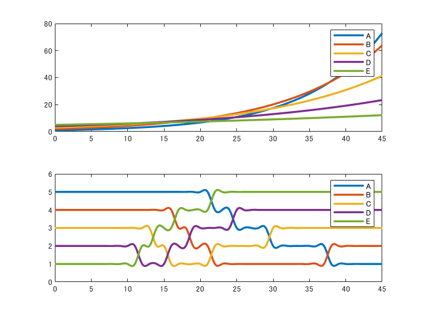

# Bar Chart Race Plot

Copyright 2020 michio

This repository provides sample scripts which will generate a bar chart race plot. This can be a good example to work with Graphics Object of MATLAB.

- `barChatRace_UniColor.m`: Single color version
- `barChatRace_multiColor_oneBar.m`: Multi-color version with one bar object.
- `barChatRace_multiColor_multiBar.m`: Multi0color version with multi-bar objects (for users with R2017a or earlier.)

# Sample Dataset

Here's a toy data set and its transition of rankings. The variable A starts from 5th place and move to 1st place in the end. 

Just run the code (no toolboxes required)

