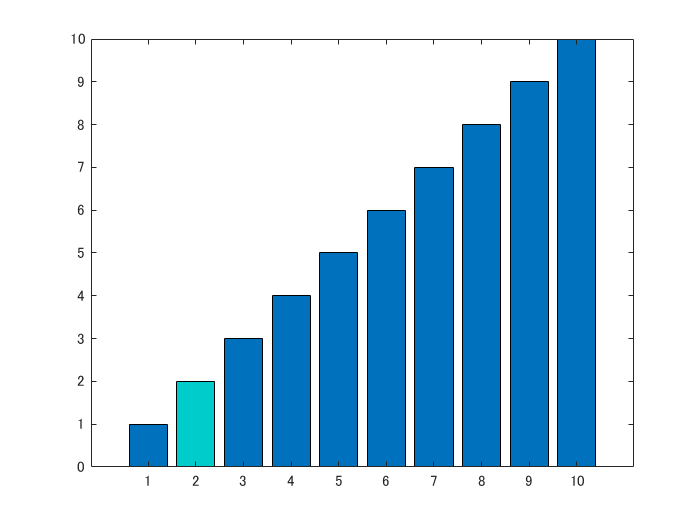

# Bar Chart Race in MATLAB: getting started with `barh`


Copyright 2020 Michio Inoue


# Introduction


Have you seen "Bar Chart Race" ? The plot describes the time-series data and ranking of each variable over time. I heard some people asked me if I could write this in MATLAB, so I tried it. 


In this document, we are going to see if `barh` function of MATLAB is capable of drawing such animation.


# Horizontal Bar Plot


Let us start with `barh` to write a bar graph.


```matlab
clear; close all
x = 1:5;
y = (1:5)/10;
handle_bar = barh(x,y);
```


Very simple, `x` is the position of the bar in `y` axis, and `y` is the length of each bar, which is rather counter intuitive.


# Switch the Bar Position


Let's look at the properties of bar object.


```matlab
handle_bar
```
```
handle_bar = 
  Bar のプロパティ:

    BarLayout: 'grouped'
     BarWidth: 0.8000
    FaceColor: [0 0.4470 0.7410]
    EdgeColor: [0 0 0]
    BaseValue: 0
        XData: [1 2 3 4 5]
        YData: [0.1000 0.2000 0.3000 0.4000 0.5000]

  すべてのプロパティ を表示

```


As you can see, the position of each bar along the y axis is controled by  `XData` property. In order to swap 2 and 3, 


```matlab
handle_bar.XData = [1,3,2,4,5];
```


Positions 3 and 2 have been switched.


# Move the Bar Position 


You can describe the transtion of ranking if you can speficy some dicimal points as the positions of each bar. Let us change 2 to 2.8 and 3 to 2.2 to illustrate that bar 2 and bar 3 have just passed by.


```matlab
handle_bar.XData = [1,2.8,2.2,4,5];
```


## Hmm something is not right


The position has indeed been changed, but something is wrong. Yes, the width of the bars are now too slim. 


This is actually an expected behavior since `barh` draws bars so that each bar does not overlap with each other. Since bar 2 and 3 got closer, the width is smaller now. What shoudl we do? Change the value of the `BarWidth` property. The default value is 0.8 and it's meant to have some gaps between bars. 


> Relative width of individual bars, specified as a scalar value in the range `[0,1]`. Use this property to control the separation of bars within a group. The default value is `0.8`, which means that MATLAB separates the bars slightly. If you set this property to `1`, then adjacent bars touch. (see [Bar のプロパティ](https://www.mathworks.com/help/matlab/ref/matlab.graphics.chart.primitive.bar-properties.html))


```matlab
handle_bar.BarWidth
```
```
ans = 0.8000
```
# `BarWidth` Property


So how much should this be? The interval of the bars was originally 1, and BarWidth of 0.8 results in a nice view. Intuition tells me that BarWidth should be inversely proportional to the minimum gap of each bar.


Let us try that. The current position of bars are


```matlab
tmp = handle_bar.XData
```
```
tmp = 1x5    
    1.0000    2.8000    2.2000    4.0000    5.0000

```


and let's calculate the minimum distance between the bars and we get


```matlab
scaleWidth = min(diff(sort(tmp)))
```
```
scaleWidth = 0.6000
```


`Sorting is performed before getting difference since the position may not monotonically increasing. And scaling the BarWidth by this factor,`


```matlab
handle_bar.BarWidth = 0.8/scaleWidth;
```


Looks good :)


So, now we see we can draw the bar chart race by continuously chaning the bar position in y axis according to the ranking of each variable. In order to visualize the transition you can just interpolate the data. Linear interpolation works great and maybe spline interplation adds some dynamics (just visually).


# Some Display Details


Let clean the labels of y axes. We are going to change `YTick` and `YTickLabel` of `Axes` Object. We use the `Axes` objects `YTick` and `YTickLabel`. Suppose the label on each bar is


```matlab
names = ["A","B","C","D","E"];
```


First off, let's set `YTick`, which determins the position of the label. Let's just insert the `XData` property value corresponding to the ranking (position).


```matlab
handle_axes = gca;
```
```matlab
try
    handle_axes.YTick = handle_bar.XData;
catch ME
    disp("Error: " + ME.message)
end
```
```
Error: 値は単精度型または倍精度型のベクトルで、値が増加しなければなりません
```
# YTick must be monotonically increasing


I got an error. `YTick` error will occur if `YTick` is not given a **monotonically increasing** value. Let's sort it. (In ascending order)


```matlab
[tmp,idx] = sort(handle_bar.XData,'ascend');
```


We need to change the order of the `names` of the bars according to the order of `XData` , so we will use the second output argument `idx` .


```matlab
handle_axes.YTick = tmp;
handle_axes.YTickLabel = names(idx);
```


B and C are swapped!


# Color of Bars


The bars can be individually colored using the `CData` property.


```matlab
 b = bar(1:10,'FaceColor','flat');
 b.CData (2,:) = [0 0.8 0.8];
```




Like this. See: [Bar Properties](https://translate.googleusercontent.com/translate_c?depth=1&hl=ja&rurl=translate.google.co.jp&sl=auto&sp=nmt4&tl=en&u=https://jp.mathworks.com/help/matlab/ref/matlab.graphics.chart.primitive.bar-properties.html&xid=17259,15700019,15700186,15700191,15700256,15700259,15700262,15700265,15700271&usg=ALkJrhiSrqnLTyLkFPDjx-yXJ-c7xY3eAw) for more details. Note the `CData` property is available from R2017b, so if you are using R2017a or earlier, you may use the following method: create different bar objects for each color.


```matlab
figure
x = 1:5;
y1 = [1:4,0]/10;
y2 = [0,0,0,0,5]/10;
handle_bar1 = barh(x,y1);
hold on
handle_bar2 = barh(x,y2);
hold off
```


# Conclusion


We see that we are in a good shape to generate Bar Chart Race. Next, let's write an animation that changes the ranking using sample data.


There are two things to do


   -  Obrain the ranking of each variable at each time point 
   -  Interpolate data to show transitions where ranks change 


If you can do this, all you have to do is populate the bar object!


