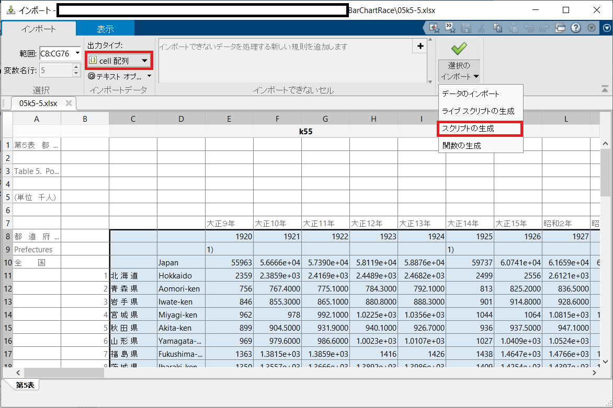
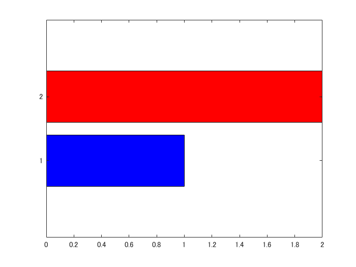
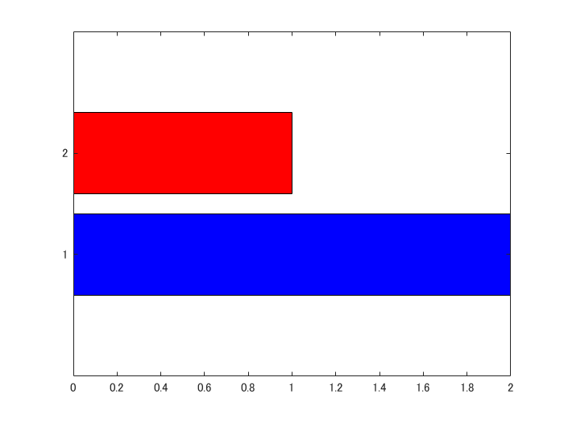

# Bar Chart Race をプロットしてみよう: 実装編


Copyright 2020 Michio Inoue


この Markdown は [minoue-xx/livescript2markdown](https://github.com/minoue-xx/livescript2markdown) を使ってライブスクリプトから自動生成しています。


# はじめに


各データの時系列変化を順位とともに表現するプロット、Bar Chart Race。


Part 1 では `barh` 関数を使って Bar Char Race が実現できそうか確認してみました。`BarWidth` プロパティの使い方が肝でしたね。今回は実装編として実際にこの動画（GIF) を作成するところまでを解説します。使用例とポイントだけに絞ってご紹介します。


  
### 実行環境


R2019b で作りましたが、下で解説する Arguments に関わる部分を取り除けば R2017b でも動くと思います。


# 使用例：各都道府県の推定人口推移（大正9年〜平成12年）


まず [e-Stat](https://www.e-stat.go.jp/stat-search/files?page=1&layout=datalist&toukei=00200524&tstat=000000090001&cycle=0&tclass1=000000090004&tclass2=000000090005&stat_infid=000000090265) のページから該当データをダウンロードして、`05k5-5.xlsx` というファイルが本スクリプトと同じフォルダにダウンロードされたと仮定します。


## Step 1: データ読み込み


ザクっとインポートツールから読み込むスクリプトを作りました。





「現在のフォルダ」に表示される `05k5-5.xlsx` をダブルクリックして、読み込み範囲を指定して「スクリプトの生成」をクリック。出力タイプは cell 配列で。


そのスクリプトを実行すると変数 `k55` として読み込まれるはず。（importData.m は[こちら](https://github.com/minoue-xx/BarChartRaceAnimation/tree/master/example/RegionalPopulationJapan)にもおいています。）


```matlab
importData
```
## Step 2: データ整理


時系列データは `timetable` 型でまとめると便利。注：沖縄はデータが大きく欠けているところがあるので除いています。


```matlab
% k55 から必要な部分を取り出します。
years = [k55{1,3:end}]'; % 年数
names = string(k55(4:end-1,1)); % 都道府県の名前
data = cell2mat(k55(4:end-1,3:end)); % 人口（数値部分）

% 年データを datetime 型に変更
timeStamp = datetime(years,1,1);
timeStamp.Format = 'yyyy'; % 表示は yyyy年

% timetable 型のデータ作成
T = array2timetable(data','RowTimes',timeStamp);
T.Properties.VariableNames = names; % 変数名指定
```


こんな感じのデータになります。


```matlab
head(T)
```
| |Time|北 海 道|青 森 県|岩 手 県|宮 城 県|秋 田 県|山 形 県|福 島 県|茨 城 県|栃 木 県|群 馬 県|埼 玉 県|千 葉 県|東 京 都|神奈川県|新 潟 県|富 山 県|石 川 県|福 井 県|山 梨 県|長 野 県|岐 阜 県|静 岡 県|愛 知 県|三 重 県|滋 賀 県|京 都 府|大 阪 府|兵 庫 県|奈 良 県|和歌山県|
|:--:|:--:|:--:|:--:|:--:|:--:|:--:|:--:|:--:|:--:|:--:|:--:|:--:|:--:|:--:|:--:|:--:|:--:|:--:|:--:|:--:|:--:|:--:|:--:|:--:|:--:|:--:|:--:|:--:|:--:|:--:|:--:|
|1|1920|2359|756.0000|846.0000|962|899.0000|969|1363|1350|1046|1053|1320|1336|3699|1323|1776|724.0000|747.0000|599.0000|583.0000|1563|1070|1550|2090|1069|651.0000|1287|2588|2302|565.0000|750.0000|
|2|1921|2.3859e+03|767.4000|855.3000|978|904.5000|979.6000|1.3815e+03|1.3557e+03|1.0542e+03|1.0623e+03|1.3303e+03|1.3355e+03|3.8307e+03|1359|1.7907e+03|724.7000|748.0000|602.0000|585.8000|1.5787e+03|1.0838e+03|1.5739e+03|2.1278e+03|1.0656e+03|653.2000|1.3062e+03|2.6866e+03|2.3316e+03|568.3000|757.5000|
|3|1922|2.4169e+03|775.1000|865.1000|992.1000|931.9000|986.6000|1.3859e+03|1.3666e+03|1.0645e+03|1.0708e+03|1.3411e+03|1.3543e+03|3.9842e+03|1.3808e+03|1.7993e+03|723.2000|748.8000|597.8000|589.0000|1.5858e+03|1.0949e+03|1.5964e+03|2.1696e+03|1.0677e+03|655.7000|1.3303e+03|2.7793e+03|2.3637e+03|572.3000|764.3000|
|4|1923|2.4489e+03|784.3000|880.8000|1.0225e+03|940.1000|1.0023e+03|1416|1.3892e+03|1084|1.0937e+03|1.3677e+03|1.3821e+03|3.8594e+03|1.3539e+03|1.8257e+03|733.1000|749.6000|600.3000|592.5000|1.6025e+03|1.1133e+03|1.6267e+03|2.2392e+03|1.0882e+03|658.4000|1.3614e+03|2.9269e+03|2.4091e+03|577.0000|776.0000|
|5|1924|2.4682e+03|792.1000|888.3000|1.0356e+03|926.7000|1.0107e+03|1426|1.3986e+03|1.0915e+03|1.1073e+03|1380|1.3957e+03|4.1855e+03|1.3736e+03|1.8397e+03|741.6000|750.1000|603.6000|595.0000|1.6154e+03|1.1215e+03|1.6437e+03|2.2738e+03|1.0958e+03|660.0000|1388|2.9983e+03|2.4248e+03|579.6000|780.4000|
|6|1925|2499|813.0000|901.0000|1044|936.0000|1027|1438|1409|1090|1119|1394|1399|4485|1417|1850|749.0000|751.0000|598.0000|601.0000|1629|1133|1671|2319|1108|662.0000|1406|3060|2455|584.0000|788.0000|
|7|1926|2556|825.2000|914.8000|1064|937.5000|1.0409e+03|1.4647e+03|1.4254e+03|1.0992e+03|1.1226e+03|1.4121e+03|1.4172e+03|4.6944e+03|1.4539e+03|1.8636e+03|758.2000|752.1000|597.0000|603.7000|1.6494e+03|1.1465e+03|1702|2.3695e+03|1.1146e+03|668.3000|1.4359e+03|3.1603e+03|2.4946e+03|580.7000|796.9000|
|8|1927|2.6121e+03|836.5000|928.6000|1.0815e+03|947.1000|1.0524e+03|1.4766e+03|1.4397e+03|1.1071e+03|1.1524e+03|1.4249e+03|1.4266e+03|4.8974e+03|1.4959e+03|1.8807e+03|762.6000|753.1000|600.4000|609.1000|1.6659e+03|1.1538e+03|1.7231e+03|2.4146e+03|1.1196e+03|673.5000|1462|3260|2.5311e+03|585.6000|803.5000|

## Step 3: プロット


ここまでくれば


```matlab
barChartRace(T);
```


でOK!


ただ、全データプロットすると何が何だか分かりませんので、オプションをいくつか使ってみます。


```matlab
barChartRace(T,'NumDisplay',6,'NumInterp',4,...
    'Position',[500 60 470 370],'ColorGroups',repmat("g",length(names),1),...
    'XlabelName',"上位6都道府県の人口（千人）",...
    'GenerateGIF',true,"Outputfilename",'top5.gif');
```


と実行すると、冒頭の GIF が出来上がり。


## 各種オプション


詳細は GitHub の [README.md](https://github.com/minoue-xx/BarChartRaceAnimation/blob/master/README.md) か


```matlab
help barChartRace
```


で見てもらいたいんですが、例えば


   -  `'NumDisplay'`: 上位何位まで表示するか（default: 全部） 
   -  `'FontSize'`: プロットで使うのフォントサイズ（default: 15） 
   -  `'GenerateGIF'`: GIF を出力するかどうか（defaiut: false） 
   -  `'LabelNames'`: `timetable` 型または `table` 型変数の場合は変数の名前をそのまま使いますが、このオプションで指定可 
   -  `'Position'`: 作成される Figure の大きさ 


といったものを入れました。


### Arguments


R2019b から使える Arguments (詳細：[Argument Validation Functions](https://jp.mathworks.com/help/matlab/matlab_prog/argument-validation-functions.html)) を使って、こんな感じでオプションの一覧を表示されるようにしてるので、オプション選択も多少楽になっているでしょうか？


`barChartRace.m` の冒頭にある 


```matlab
arguments
    inputs {mustBeNumericTableTimetable(inputs)}
    options.Time (:,1) {mustBeTimeInput(options.Time,inputs)} = setDefaultTime(inputs)
    options.LabelNames {mustBeVariableLabels(options.LabelNames,inputs)} = setDefaultLabels(inputs)
    options.ColorGroups {mustBeVariableLabels(options.ColorGroups,inputs)} = setDefaultLabels(inputs)
    (中略)
```


部分が対応します。網羅するのは結構大変でしたが、ちゃんと意図した変数が入力されているかどうかのチェックもするようにしてます。例えば・・


```matlab
barChartRace('エラーが出るよ')
```
```
エラー: barChartRace
位置 1 の入力引数が無効です。 Input data must be either timetable, table, or numeric array (double)
```


1つ目の入力は timetable 型か time 型か double の配列でお願いしますとか、


```matlab
barChartRace(T,'LabelNames',"これも良くないよ")
```
```
エラー: barChartRace
名前と値の引数 'LabelNames' が無効です。 The size must be same as the number of variables of inputs (46)
```


`'LabelName'` というオプションは input と同じ変数の数 (46個) 用意してねとか、エラーの原因を表示させる感じ。自分で使う関数なら必要ないかもしれませんが、他の人にも使ってもらうならあったほうが便利かなと思い入れました。


  
# 描画のポイント１：データの内挿


各棒が順位入れ替えをする状況を表現するには順位データの内挿が必要です。`barChartBar.m` の中では


```matlab
%% Interpolation: Generate nInterp data point in between
time2plot = linspace(time(1),time(end),length(time)*NumInterp);
ranking2plot = interp1(time,rankings,time2plot,Method);
data2plot = interp1(time,data,time2plot,Method);
```


こんな感じ。`interp1` 関数使っています。


ここの `Method` で内挿方法を指定するんですが、シンプルに線形内挿すると上のような動画。ここで `spline` 補間なんかしてしまうと、棒の位置がオーバーシュートするダイナミックさが加わります。いりませんね（笑）


コマンドはこんな感じ：`'Method'` に `'spline'` を指定します。


```matlab
barChartRace(T,'NumDisplay',6,'NumInterp',4,...
    'Position',[500 60 470 370],'ColorGroups',repmat("g",length(names),1),...
    'XlabelName',"上位6都道府県の人口（千人）",'Method','spline',...
    'GenerateGIF',true,"Outputfilename",'top5Spline.gif');
```
# 描画のポイント２：CData


前回も nonlinopt さんにご指摘頂いた通り各棒の色は `CData` プロパティで指定できます。`'FaceColor'` を `'flat'` に設定することにも注意。


ただ曲者なのは CData 内の色の順番は各棒の位置と連動してしまっていること。例えば `CData` をそのままにしておくと、もともとの順位（1 位：赤と 2 位：青）が逆転すると、1 位が青で 2 位が赤になっちゃいます。


例えば


```matlab
hb = barh([1,2],'FaceColor','flat');
hb.CData = [0,0,1
    1,0,0];
```




もともとの設定では上が赤、下が青ですが、その位置を変更すると・・


```matlab
hb.XData = [2,1];
```




色の順番がそのまま。まぁ、、当然と言えば当然な気もしますが。ですので、ひと手間加えて `CData` 内の順番も合わせて変更する必要があります。`barChartBar.m` の中では


```matlab
    % Set YTick position by ranking
    % Set YTickLabel with variable names
    [ytickpos,idx] = sort(ranking,'ascend');
    handle_axes.YTick = ytickpos;
    handle_axes.YTickLabel = LabelNames(idx);
    
    % Fix CData
    handle_bar.CData = colorScheme(idx,:);
```


といった感じで `YTick` の順位変更に合わせて `CData` も改めて変更しています。


# 描画のポイント３：棒の横の数値表示


これは `text` オブジェクトを使っています。こちらの記事（[MATLABのプロットでアノテーションをつける](https://qiita.com/Monzo_N/items/c68f52e88fd532671a19)）のコメントでもやり取りがありますが、`text` オブジェクトのいいところは、プロットしているデータと同じ座標系で位置指定ができること。Figure 内の相対的位置とか、Axes 内の相対的位置を計算する必要がないのは、直感的に使いやすいです。`barChartRace.m` 内では近感じ。


```matlab
% Add value string next to the bar
if IsInteger
    displayText = string(round(value2plot(idx)));
else
    displayText = string(value2plot(idx));
end
xTextPosition = value2plot(idx) + maxValue*0.05;
yTextPosition = ytickpos;

% NumDisplay values are used
xTextPosition = xTextPosition(1:NumDisplay);
yTextPosition = yTextPosition(1:NumDisplay);
displayText = displayText(1:NumDisplay);
handle_text = text(xTextPosition,yTextPosition,displayText,'FontSize',options.FontSize);
```


最大値の 5\% だけ各数値から右にずらした位置に数値を表示しています。もともとのデータが整数の場合は整数に丸めて表示するオプションいれています。内挿してしまっているのでそのまま表示すると、人口が小数点表示になっちゃうから・・（多少苦しい）


# おまけのポイント


表示されたプロットみると "Visualized by MATLAB" とアピールがひどい部分がありますね（笑）


これは `barCharRace.m` 内では以下の一行で書いているんですが、どうぞ皆さん好きな文字に変えて使ってくださいませ。


```matlab
% Display created by MATLAB message
text(0.99,0.02,"Visualized by MATLAB",'HorizontalAlignment','right',...
    'Units','normalized','FontSize', 10,'Color',0.5*[1,1,1]);
```
# まとめ


以上、簡単ではありますが `barChartRace` 関数内でのポイント紹介でした。


人口推移、人気プログラミング言語ランキング、各企業の時価総額ランキング、各国の出生率ランキング、各大学偏差値ランキングなどなどデータさえあれば面白そうなプロットができそうな気がします。


どうぞ試して面白いプロット見せてください。`barChartRace` 関数で困ったことあれば遠慮なくコメントください。


