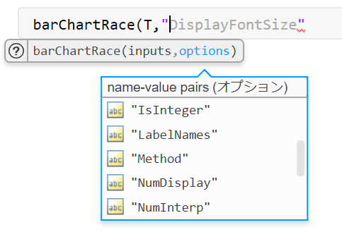

# 入力引数のデフォルト値設定と検証方法: Arguments を使う場合


Copyright (c) 2020 Michio Inoue


# はじめに


MATLABでデフォルト引数を設定するには、`nargin` を使ったり正直ハードルが高い[^1]。


ただそれも R2019a まで。


R2019b から使える Arguments (詳細：[Argument Validation Functions](https://jp.mathworks.com/help/matlab/matlab_prog/argument-validation-functions.html)) を使うとかなり楽ちんなので紹介します。


  
## なにが嬉しいの？

   1.  入力引数のデフォルト値設定が楽 
   1.  入力引数の検証もかなり楽 
   1.  関数使用時のオプション選択がちょっとカッコいい 


それぞれ以下で紹介します。


  
## 使用環境


MATLAB R2019b 以降


MathWorks のブログでもいくつか使用例が紹介されているのでよろしければご覧くださいませ。


   -  [お気に入りR2019b新機能 – 入力引数の検証](https://blogs.mathworks.com/japan-community/2019/11/05/favorite-r2019b-feature/) 
   -  [入力引数の検証～隠された便利機能](https://blogs.mathworks.com/japan-community/2019/11/27/function-arguments-part2/) 


`[^1]:nargin` を使った方法については @kenichi-hamaguchi さんの投稿 [[matlab] デフォルト引数の設定方法](https://qiita.com/kenichi-hamaguchi/items/d4e451e67ebf380a48c6) で具体的な方法・例が紹介されていますので是非。


  
# 使い方：基本構文


基本構文は（画像は[公式ページ](https://jp.mathworks.com/help/matlab/matlab_prog/function-argument-validation-1.html#mw_7d29b198-98bc-4268-93a2-d74504d2b023)から引用）


で、4つの要素があります。入力引数名（`inputArg`）の後に、


   -  想定される変数の配列サイズ（Size） 
   -  double 型かどうかといったクラス名（Class） 
   -  そして検証に使う関数（Functions） 


が続いて、最後に `defaultValue` でデフォルト値を設定します。全部書く必要はなく、必要なものだけ使えばOK。


  
# 1. 入力引数のデフォルト値設定が楽


まずはデフォルト値設定から。上でみた `defaultValue` を使います。


```matlab:Code(Display)
function c = myFunction(a,b)

arguments
    a = 1
    b = 2
end

c = a+b;
end
```


こんな感じにしておけば、入力無しで実行したり、入力１つで実行すると以下の結果になります。


```matlab:Code
myFunction
```


```text:Output
linear
ans = 3
```


```matlab:Code
myFunction(10)
```


```text:Output
linear
ans = 12
```


省略した引数にデフォルト値が使われていることが分かりますね。


  
# 2. 入力引数の検証も楽


たとえば a はスカラー値でないといけないのであれば、


```matlab:Code(Display)
function c = myFunction(a,b)

arguments
    a (1,1) = 1
    b = 2
end

c = a+b;
end
```


としておけば、スカラー値以外が入力されたときにエラーを返します。試しに 1x2 のベクトルを入力してみます。


```matlab:Code
myFunction([1,2])
```


```text:Output
エラー: myFunction
位置 1 の引数が無効です。 値はスカラーでなければなりません。
```


ちゃんとエラーの原因まで返してくれています。


## 引数の検証関数


いくつか入力値の検証用関数（[引数の検証関数の一覧](https://jp.mathworks.com/help/matlab/matlab_prog/argument-validation-functions.html)）も用意されています。例えば整数（`mustBeInteger`）でないとだめ、とか実数（`mustBeReal`）などなど。


それぞれの組み合わせで入力値の検証を行えると話は早いです。例えば・・入力は整数じゃないといけない、ということであれば


```matlab:Code(Display)
function c = myFunction(a,b)

arguments
    a (1,1) {mustBeInteger(a)} = 1
    b = 2
end

c = a+b;
end
```


```matlab:Code
myFunction(1.1)
```


```text:Output
エラー: myFunction
位置 1 の引数が無効です。 値は整数でなければなりません。
```


こんな感じ。検証用関数は `{}` で囲まないといけません。もちろん 2つ以上使ってもいいです。


```matlab:Code(Display)
function c = myFunction(a,b)

arguments
    a (1,1) {mustBeInteger(a),mustBePositive(a)} = 1
    b = 2
end

c = a+b;
end
```


整数（`mustBeInteger`）かつ正の数（`mustBePositive`）という条件にしてみます。


```matlab:Code
myFunction(-1)
```


```text:Output
エラー: myFunction
位置 1 の引数が無効です。 値は正でなければなりません。
```

  
## もっとややこしいことしたい場合


もちろん用意された検証用関数だけだと、足りない場合もあります。


例えば以前「[ぬめぬめ動く棒グラフ Bar Chart Race を描いてみよう: 実装編](https://qiita.com/eigs/items/c1675e6dc6fd497e714a)」で紹介した barChartRace 関数（[Link to GitHub](https://github.com/minoue-xx/BarChartRaceAnimation/blob/master/function/barChartRace.m)）だと、


```matlab:Code(Display)
arguments
    inputs {mustBeNumericTableTimetable(inputs)}
    options.Time (:,1) {mustBeTimeInput(options.Time,inputs)} = setDefaultTime(inputs)
    options.LabelNames {mustBeVariableLabels(options.LabelNames,inputs)} = setDefaultLabels(inputs)
    options.ColorGroups {mustBeVariableLabels(options.ColorGroups,inputs)} = setDefaultLabels(inputs)
    options.Position (1,4) {mustBeNumeric,mustBeNonzero} = get(0, 'DefaultFigurePosition')
    (中略)
```


と結構頑張って書いていて、`mustBeTimeInput`、`mustBeVariableLabels` は自分で作った検証用関数、`setDefaultTime` はデフォルト値を設定する関数として作りました。


それぞれの関数はここ（[Link to GitHub](https://github.com/minoue-xx/BarChartRaceAnimation/tree/master/function/private)）にありますが、例えば `mustBeTimeInput` を見てみると、、


```matlab:Code(Display)
function mustBeTimeInput(arg, inputs)
% Custom validation function for Name-Pair Value 'Time'
% Copyright 2020 Michio Inoue

if ~(isnumeric(arg) || isdatetime(arg))
    error("The datatype must be numeric or datetime.");
end

if length(arg) ~= size(inputs,1)
    error("The length must be same as that of inputs ("...
        + num2str(size(inputs,1)) + ")");
end
end
```


入力引数 `arg `は数値もしくは `datetime` 型で、それに加えて必須である引数 `inputs` と同じ長さでないといけないという条件にしています。


### 初期値設定もややこしいことしたい場合


`setDefaultTime` も `inputs` が `timetable` 型であればその時刻を使うし、そうでなければ・・という形で定義していました。


```matlab:Code(Display)
function time = setDefaultTime(inputs)
% A function to generate the default values for 'Time'
% Copyright 2020 Michio Inoue

if isa(inputs,'timetable')
    time = inputs.Time;
else
    time = 1:size(inputs,1);
end
```


初期値設定用の関数は出力さえだせば何でもよいので、例えば


```matlab:Code(Display)
options.Position (1,4) {mustBeNumeric,mustBeNonzero} = get(0, 'DefaultFigurePosition')
```


は、`Position` (Figureのプロパティ)に指定が無ければデフォルト値を使う、という意図になっています。


# 3. 関数使用時にオプション選択がちょっとカッコいい


Live Editor 上で使う場合のこんな表示。これが自分の関数でも簡単にできるようになります。


上の例だと、期待される入力引数は何か・デフォルト値設定がある場合には「オプション」との表示まででます。


## Name-Value Pair （オプション）を加えてみる


関数実行時に使うオプション設定ですね。特に用途はないですが・・`'Method'` も取れるようにしてみます。 


```matlab:Code(Display)
function c = myFunction(a,b,options)

arguments
    a (1,1) {mustBeInteger(a),mustBePositive(a)} = 1
    b = 2
    options.Method {mustBeMember(options.Method,{'linear','spline'})} = 'linear'
end

c = a+b;
disp(options.Method);
end
```


`options.Method` という形にしたところは、関数入力時に name-value pairs （オプション）としてリストが出てきます。


この機能で個人的にお気に入りなのは、`mustBeMember` を使った場合。'Method' は 'linear' か 'spline' しかダメですよー、という検証しているんですが、これ検証時だけじゃなくて入力時にも活躍します。


というように、'Method' で求められているものはこれだけです、と明示してくれます。ちなみに、上で紹介した `barChartRace.m` だとこんな感じ。





# まとめ


Arguments を使ったデフォルト引数設定の仕方、から脱線して入力値の検証まで紹介しました。


まぁ、正直自分で使う関数なら必要ないかな・・と思います。ただ、1 週間前の自分のコードはもはや他人のコード。他の人にも使ってもらうならあったほうがいいです。エラーの原因を一生懸命探した結果、入力値が想定と違っていただけ・・なんて悲しいですからね。


もちろん R2019a 以前でも同じことはできますが、Arguments を使う方法と比べると大変。


   -  [お気に入りR2019b新機能 – 入力引数の検証](https://blogs.mathworks.com/japan-community/2019/11/05/favorite-r2019b-feature/) 
   -  [入力引数の検証～隠された便利機能](https://blogs.mathworks.com/japan-community/2019/11/27/function-arguments-part2/) 


では古い方法との比較もしていますので、興味のある方はどうぞ！


