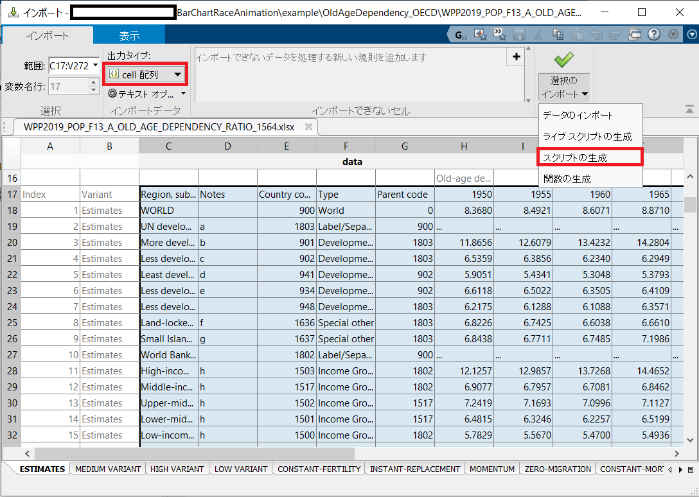
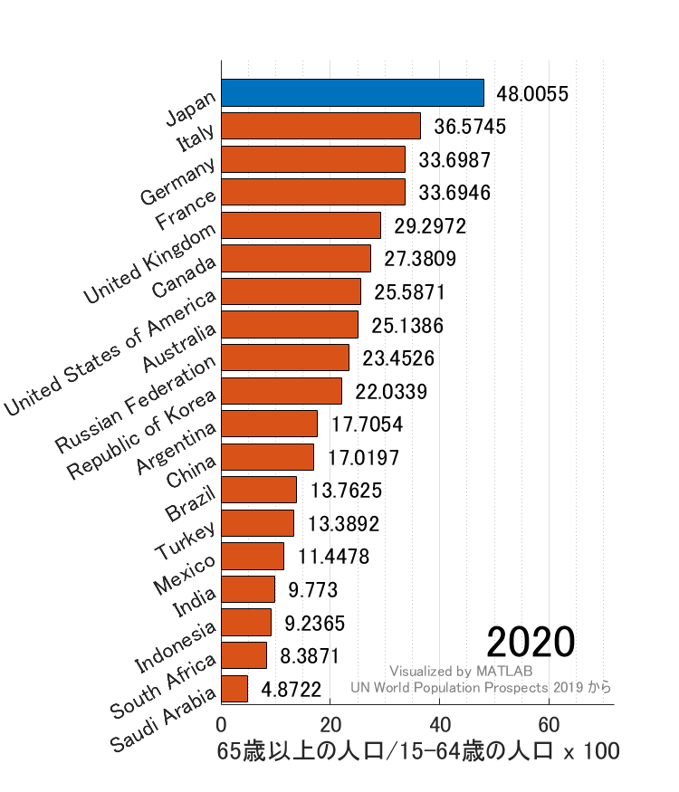

# Old Age Dependency Ratio


Copyright (c) 2020 Michio Inoue


まず[国連：World Population Prospects 2019](https://population.un.org/wpp/Download/Standard/Population/)のページからデータをダウンロードします。


`WPP2019_POP_F13_A_OLD_AGE_DEPENDENCY_RATIO_1564.xlsx` というファイルが本スクリプトと同じフォルダにダウンロードされたと仮定します。


```matlab
addpath("../../function")
```
# データ読み込み


ザクっとインポートツールから読み込むスクリプトを作りました。変数 data として読み込まれるはず。出力タイプは cell 配列。





```matlab
importData
```
# データ整理


時系列データは `timetable` 型が便利なのでこちらでまとめてみます。


注：G20 のデータだけ使います。


```matlab
G20List = ["United States of America","United Kingdom","France","Germany","Japan",...
 "Italy","Canada","Russian Federation","China","India",...
 "Brazil","Mexico","South Africa","Australia","Republic of Korea",...
 "Indonesia","Saudi Arabia","Turkey","Argentina"];

names = string(data(:,1)); % 国と地域名
ismemberG20 = ismember(names,G20List); % G20 だけ抽出
data = cellfun(@double, data(ismemberG20,6:20)); %数値部分
years = 1950:5:2020; % 年数

% 年データを datetime 型に変更
timeStamp = datetime(years,1,1);
timeStamp.Format = 'yyyy'; % 表示は yyyy年

% timetable 型のデータ作成
T = array2timetable(data','RowTimes',datetime(years,1,1),...
    'VariableNames',names(ismemberG20));
T.Time.Format = 'yyyy';
```


こんな形になります。


```matlab
head(T)
```
| |Time|South Africa|Saudi Arabia|Turkey|India|China|Japan|Republic of Korea|Indonesia|Mexico|Argentina|Brazil|Australia|Russian Federation|United Kingdom|Italy|France|Germany|Canada|United States of America|
|:--:|:--:|:--:|:--:|:--:|:--:|:--:|:--:|:--:|:--:|:--:|:--:|:--:|:--:|:--:|:--:|:--:|:--:|:--:|:--:|:--:|
|1|1950|7.0679|6.1090|5.1890|5.2868|7.1988|8.2237|5.2490|6.9636|6.4677|6.4525|5.3630|12.5214|7.3968|16.2371|12.4072|17.2880|14.3650|12.2054|12.6425|
|2|1955|6.9799|6.5377|5.6919|5.4275|6.9445|8.5801|5.8686|6.5080|6.3421|7.5410|5.5291|13.5219|8.1687|17.2512|13.3929|18.0801|15.4948|12.9923|14.2041|
|3|1960|6.9829|6.8034|5.8103|5.3935|6.5296|8.7667|6.3075|6.2905|6.6805|8.7229|5.8687|14.0677|9.5739|18.0822|14.5576|18.7958|17.1059|13.1437|15.1441|
|4|1965|7.0746|6.7505|6.9123|5.8309|6.1803|9.0735|6.5274|6.1157|7.2306|9.7699|6.2590|13.9549|10.4408|18.9093|15.6110|19.4236|19.2910|13.1505|15.6445|
|5|1970|6.8763|6.5734|7.3275|5.9240|6.7115|9.9628|6.2884|6.1756|7.5686|10.9179|6.3188|13.1690|11.6844|20.7509|17.3297|20.6237|21.5708|12.9711|16.2499|
|6|1975|6.9422|6.2027|8.1356|6.1614|7.2840|11.3442|6.4901|6.3564|7.5845|12.0045|6.4722|13.7964|13.2939|22.4935|19.1416|21.5459|23.3975|13.0228|16.6973|
|7|1980|6.9808|5.6689|8.4742|6.3164|7.8705|13.2060|6.6396|6.4454|7.6561|13.2064|6.6051|14.7886|15.0934|23.3440|20.6571|21.8589|23.7949|13.9021|17.5711|
|8|1985|7.0373|4.7604|7.7100|6.4414|8.3028|14.8151|6.8447|6.3126|7.4038|14.0487|6.7010|15.4839|14.5769|23.0340|19.4124|19.6336|20.9633|14.9816|18.3070|

# プロット描画


日本だけ色を変えるために `colorGroup` を定義。


```matlab
isJapan = contains(T.Properties.VariableNames,"Japan");
colorGroup = repmat("others",width(T),1);
colorGroup(isJapan) = "Japan";
```


プロット作成


```matlab
barChartRace(T,'IsInteger',false,'NumInterp',10,...
    'ColorGroups',colorGroup,...
    'XlabelName',"65歳以上の人口/15-64歳の人口 x 100",...
    'Position',  [400  180  500  600],...
    'YTickLabelRotation',30,...
    'FontSize',10,...
    'DisplayFontSize',20,'GenerateGIF',true,...
    'Footnote',["Visualized by MATLAB","UN World Population Prospects 2019 から"])
```



```
ans = 
  Figure (LiveEditorRunTimeFigure) のプロパティ:

      Number: 1
        Name: ''
       Color: [1 1 1]
    Position: [400 180 500 600]
       Units: 'pixels'

  すべてのプロパティ を表示

```
## 各オプションの解説


詳細は


```matlab
help barChartRace
```


で表示するか、README.md で確認ください。


   -  ColorGroups: 色分けの指定。文字列は何でも良いですが、同じ文字＝同じ色で描きます。 
   -  XlabelName: x軸の名前。 
   -  GenerateGIF: `true` で gif ファイル生成します。既定では `false` です。 

