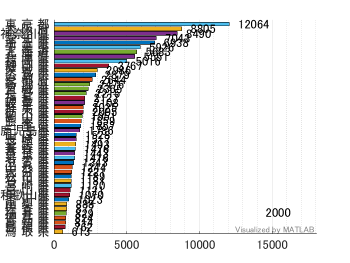
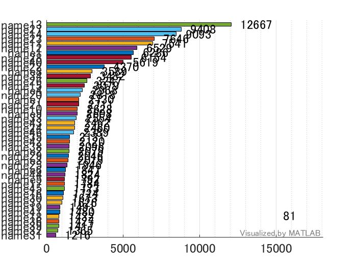
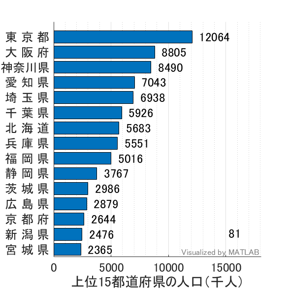

# 各都道府県の推定人口推移（大正9年〜平成12年）


Copyright (c) 2020 Michio Inoue


まず [e-Stat](https://www.e-stat.go.jp/stat-search/files?page=1&layout=datalist&toukei=00200524&tstat=000000090001&cycle=0&tclass1=000000090004&tclass2=000000090005&stat_infid=000000090265) のページからデータをダウンロードします。


`05k5-5.xlsx` というファイルが本スクリプトと同じフォルダにダウンロードされたと仮定します。


```matlab
addpath("../../function")
```
# データ読み込み


ザクっとインポートツールから読み込むスクリプトを作りました。変数 `k55` として読み込まれるはず。


```matlab
importData
```
# データ整理


時系列データは `timetable` 型が便利なのでこちらでまとめてみます。


注：沖縄はデータが大きく欠けているところがあるので除いています。


```matlab
% k55 から必要な部分を取り出します。
years = [k55{1,3:end}]'; % 年数
names = string(k55(4:end-1,1)); % 都道府県の名前
data = cell2mat(k55(4:end-1,3:end)); % 人口（数値部分）

% 年データを datetime 型に変更
timeStamp = datetime(years,1,1);
timeStamp.Format = 'yyyy'; % 表示は yyyy年

% timetable 型のデータ作成
T = array2timetable(data','RowTimes',timeStamp);
T.Properties.VariableNames = names; % 変数名指定
```


こんな形になります。


```matlab
head(T)
```
| |Time|北 海 道|青 森 県|岩 手 県|宮 城 県|秋 田 県|山 形 県|福 島 県|茨 城 県|栃 木 県|群 馬 県|埼 玉 県|千 葉 県|東 京 都|神奈川県|新 潟 県|富 山 県|石 川 県|福 井 県|山 梨 県|長 野 県|岐 阜 県|静 岡 県|愛 知 県|三 重 県|滋 賀 県|京 都 府|大 阪 府|兵 庫 県|奈 良 県|和歌山県|
|:--:|:--:|:--:|:--:|:--:|:--:|:--:|:--:|:--:|:--:|:--:|:--:|:--:|:--:|:--:|:--:|:--:|:--:|:--:|:--:|:--:|:--:|:--:|:--:|:--:|:--:|:--:|:--:|:--:|:--:|:--:|:--:|
|1|1920|2359|756.0000|846.0000|962|899.0000|969|1363|1350|1046|1053|1320|1336|3699|1323|1776|724.0000|747.0000|599.0000|583.0000|1563|1070|1550|2090|1069|651.0000|1287|2588|2302|565.0000|750.0000|
|2|1921|2.3859e+03|767.4000|855.3000|978|904.5000|979.6000|1.3815e+03|1.3557e+03|1.0542e+03|1.0623e+03|1.3303e+03|1.3355e+03|3.8307e+03|1359|1.7907e+03|724.7000|748.0000|602.0000|585.8000|1.5787e+03|1.0838e+03|1.5739e+03|2.1278e+03|1.0656e+03|653.2000|1.3062e+03|2.6866e+03|2.3316e+03|568.3000|757.5000|
|3|1922|2.4169e+03|775.1000|865.1000|992.1000|931.9000|986.6000|1.3859e+03|1.3666e+03|1.0645e+03|1.0708e+03|1.3411e+03|1.3543e+03|3.9842e+03|1.3808e+03|1.7993e+03|723.2000|748.8000|597.8000|589.0000|1.5858e+03|1.0949e+03|1.5964e+03|2.1696e+03|1.0677e+03|655.7000|1.3303e+03|2.7793e+03|2.3637e+03|572.3000|764.3000|
|4|1923|2.4489e+03|784.3000|880.8000|1.0225e+03|940.1000|1.0023e+03|1416|1.3892e+03|1084|1.0937e+03|1.3677e+03|1.3821e+03|3.8594e+03|1.3539e+03|1.8257e+03|733.1000|749.6000|600.3000|592.5000|1.6025e+03|1.1133e+03|1.6267e+03|2.2392e+03|1.0882e+03|658.4000|1.3614e+03|2.9269e+03|2.4091e+03|577.0000|776.0000|
|5|1924|2.4682e+03|792.1000|888.3000|1.0356e+03|926.7000|1.0107e+03|1426|1.3986e+03|1.0915e+03|1.1073e+03|1380|1.3957e+03|4.1855e+03|1.3736e+03|1.8397e+03|741.6000|750.1000|603.6000|595.0000|1.6154e+03|1.1215e+03|1.6437e+03|2.2738e+03|1.0958e+03|660.0000|1388|2.9983e+03|2.4248e+03|579.6000|780.4000|
|6|1925|2499|813.0000|901.0000|1044|936.0000|1027|1438|1409|1090|1119|1394|1399|4485|1417|1850|749.0000|751.0000|598.0000|601.0000|1629|1133|1671|2319|1108|662.0000|1406|3060|2455|584.0000|788.0000|
|7|1926|2556|825.2000|914.8000|1064|937.5000|1.0409e+03|1.4647e+03|1.4254e+03|1.0992e+03|1.1226e+03|1.4121e+03|1.4172e+03|4.6944e+03|1.4539e+03|1.8636e+03|758.2000|752.1000|597.0000|603.7000|1.6494e+03|1.1465e+03|1702|2.3695e+03|1.1146e+03|668.3000|1.4359e+03|3.1603e+03|2.4946e+03|580.7000|796.9000|
|8|1927|2.6121e+03|836.5000|928.6000|1.0815e+03|947.1000|1.0524e+03|1.4766e+03|1.4397e+03|1.1071e+03|1.1524e+03|1.4249e+03|1.4266e+03|4.8974e+03|1.4959e+03|1.8807e+03|762.6000|753.1000|600.4000|609.1000|1.6659e+03|1.1538e+03|1.7231e+03|2.4146e+03|1.1196e+03|673.5000|1462|3260|2.5311e+03|585.6000|803.5000|

# プロット描画
```matlab
barChartRace(T);
```




全データプロットすると何が何だか分かりませんね。


## 各オプションの解説（一部）


詳細は


```matlab
help barChartRace
```


で表示するか、README.md で確認ください。


```matlab
barChartRace(T,'NumDisplay',15,'NumInterp',4,...
    'Position',[ 500 60 470 470],'ColorGroups',repmat("g",length(names),1),...
    'XlabelName',"上位15都道府県の人口（千人）",'GenerateGIF',false);
```


使用したオプションの意味は以下：


   -  NumDisplay: 上位何位まで表示するか。既定値は全データ表示です。 
   -  NumInterp: データの内挿点数。数が多い程滑らかに推移します。既定値は 2。 
   -  Position: 作成される Figure の大きさ。 
   -  ColorGroups: 色分けの指定。文字列は何でも良いですが、同じ文字＝同じ色で描きます。既定値はすべてのバーを 7 色で分けます。 
   -  XlabelName: x軸の名前。既定値は空（何も表示しません） 
   -  GenerateGIF: `true` で gif ファイル生成します。既定値は `false` です。 

# 入力が数値配列のケース


`barChartRace` 関数は数値データ（2次元配列）も受け付けます。縦方向が時間変化


```matlab
data = T.Variables;
```


で数値部分だけ取り出した変数を使ってみます。


```matlab
data = T.Variables;
barChartRace(data);
```




変数の名前は適当に name(数値) で描かれます。時間情報が無いので左下もただの数値（何番目のデータか）になっています。オプションを使ってみます。


## 各オプションの解説（一部）
```matlab
barChartRace(data,'NumDisplay',15,'LabelNames',names,...
    'Position',[500 60 470 470],'ColorGroups',repmat("g",length(names),1),...
    'XlabelName',"上位15都道府県の人口（千人）",'GenerateGIF',false);
```




   -  LabelNames: `timetable` 型または `table` 型変数の場合は変数の名前をそのまま使いますが、このオプションで指定することも可能です。 
   -  Position: 作成される Figure の大きさ。 
   -  ColorGroups: 色分けの指定。文字列は何でも良いですが、同じ文字＝同じ色で描きます。 
   -  XlabelName: x軸の名前。 
   -  GenerateGIF: `true` で gif ファイル生成します。既定では `false` です。 

